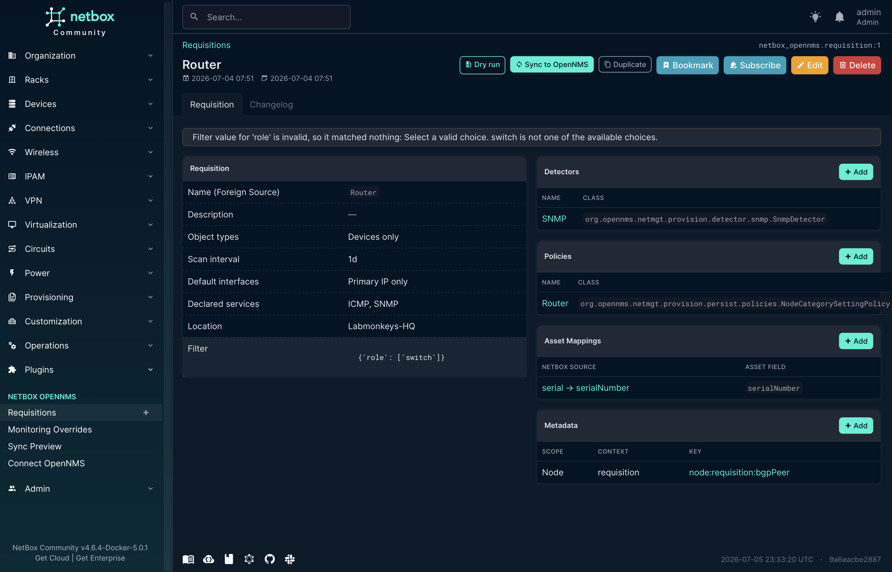
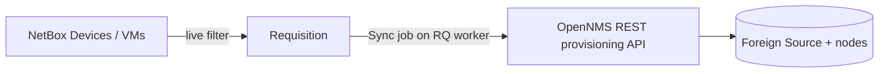

# netbox-opennms-plugin

Provision NetBox devices and virtual machines into **OpenNMS Horizon 36** as requisition nodes.
NetBox holds the monitoring intent. The plugin renders it into OpenNMS requisitions and imports them over the REST provisioning API.

[](https://github.com/no42-org/netbox-opennms-plugin/actions/workflows/ci.yml)
[](https://github.com/no42-org/netbox-opennms-plugin/releases)
[](./LICENSE)


[](https://no42-org.github.io/netbox-opennms-plugin/)
[](https://pepy.tech/projects/netbox-opennms-plugin)

📖 **[Documentation & contributor guide →](https://no42-org.github.io/netbox-opennms-plugin/)**





## Contents

- [Features](#features)
- [Compatibility](#compatibility)
- [Try it locally](#try-it-locally)
- [Install the plugin](#install-the-plugin)
- [Prepare OpenNMS](#prepare-opennms)
- [Configure the connection](#configure-the-connection)
- [Run the sync worker](#run-the-sync-worker)
- [Deploy on Kubernetes](#deploy-on-kubernetes)
- [Architecture](#architecture)
- [Reference](#reference)
- [Troubleshoot](#troubleshoot)
- [Contribute](#contribute)
- [Support the project](#support-the-project)
- [License](#license)

## Features

| Feature | Description |
| --- | --- |
| Filter-based Requisitions | A Requisition is one user-named OpenNMS Foreign Source. Its members are a live NetBox filter (role, tag, site, status, custom field, …) over Devices and/or Virtual Machines. |
| Discovery-driven detectors & policies | Classes and parameters are read from your live OpenNMS over REST. A curated preset overlay adds labels and defaults. A freeform class is always accepted. |
| Per-interface SNMP roles | The management IP is the Primary SNMP interface by default. Add more IPs as Primary, Secondary or Not-eligible. |
| Asset & metadata enrichment | Map NetBox inventory to OpenNMS node asset fields. Attach metadata at node, interface or service scope. |
| Conflict safety | An object matched by two Requisitions blocks Sync of both until you resolve it. A node lives in exactly one Foreign Source. |
| Graded node status | A member with no management IP becomes an inventory-only node with a warning, not a silent skip. |
| Dry run | A per-node diff of what a Sync would add, remove or change against the live OpenNMS state. |
| Background sync | Sync and Remove run as NetBox Jobs. A drift reconciler removes Foreign Sources the plugin pushed and no longer governs. |

## Compatibility

<!-- The "verified against" badge reads the pinned test image straight from
     compose.yml on main, so a Dependabot bump needs no README edit. The quality
     gates assert compose.yml and the quickstart pin agree. 4.6.1+ is the
     support contract (min_version in netbox_opennms/__init__.py) and moves only
     when the plugin needs a newer API. -->

| Component | Version |
| --- | --- |
| NetBox | 4.6.1+ &replace=%241&label=verified%20against&color=blue) |
| Python | 3.12+ |
| OpenNMS | Horizon 36 |

## Try it locally

The [`quickstart/`](quickstart/) stack runs a throwaway NetBox (UI and worker) and a disposable OpenNMS Horizon 36.
It uses fixed throwaway secrets and is not for production.

1. Start the stack:

   ```bash
   cd quickstart
   docker compose --profile opennms up -d --wait
   ```

2. Seed example Devices, VMs and Requisitions:

   ```bash
   ./seed.sh
   ```

   Expected output (after the NetBox startup log):

   ```text
   Seeded:
     sites=3 roles=3 devices=7 vms=3 requisitions=5 overrides=4

   Foreign Sources (resolved requisitions):
     netbox.durham.router         rtr-3
     netbox.raleigh.firewall      fw-1
     netbox.raleigh.router        rtr-1, rtr-2, vm-1, vm-2
     netbox.raleigh.switch        sw-1, vm-3

   Unmonitored: sw-durham (no requisition) · sw-2 (override excludes it)
   Now open http://localhost:8000/plugins/opennms/sync/ and Sync.
   ```

3. Open the Sync Preview at **`http://localhost:8000/plugins/opennms/sync/`** and log in as `admin` / `admin`.
4. Open a Requisition, click **Dry run**, then **Sync to OpenNMS**.
5. Open OpenNMS at **`http://localhost:8980/opennms`** (`admin` / `admin`) and check the requisition's nodes under the provisioning requisitions page.
6. Tear the stack down:

   ```bash
   docker compose --profile opennms down -v
   ```

The full walkthrough is in the **[Quickstart guide](https://no42-org.github.io/netbox-opennms-plugin/#local)**.

## Install the plugin

1. Install the package into NetBox's virtual environment from [PyPI](https://pypi.org/project/netbox-opennms-plugin/):

   ```bash
   /opt/netbox/venv/bin/pip install netbox-opennms-plugin
   ```

2. Add `netbox_opennms` to the existing **`PLUGINS`** list in NetBox's **`configuration.py`**:

   ```python
   PLUGINS = [
       # ...your other plugins
       "netbox_opennms",
   ]
   ```

3. Set the connection in **`PLUGINS_CONFIG`**. See [Configure the connection](#configure-the-connection).
4. Apply the migrations:

   ```bash
   /opt/netbox/venv/bin/python /opt/netbox/netbox/manage.py migrate netbox_opennms
   ```

5. Restart NetBox and its RQ worker:

   ```bash
   sudo systemctl restart netbox netbox-rq
   ```

6. Confirm the migrations are applied:

   ```bash
   /opt/netbox/venv/bin/python /opt/netbox/netbox/manage.py showmigrations netbox_opennms
   ```

   Expected output:

   ```text
   netbox_opennms
    [X] 0001_initial
    [X] 0002_requisition_redesign
    [X] 0003_deployedforeignsource
    [X] 0004_remove_requisition_priority
    [X] 0005_remove_monitoringoverride_additional_ips_and_more
    [X] 0006_assetmapping_metadataentry
   ```

## Prepare OpenNMS

The plugin writes requisitions. It does not configure OpenNMS polling.

- **Provisioning account.** Give **`opennms_username`** a role that can read and write requisitions and trigger imports.
- **Poller packages.** OpenNMS polls a discovered service only if a poller package covers it. Make sure **`poller-configuration.xml`** covers the services your detectors discover and the Requisition's declared services.
- **Minions.** A node in a location other than `Default` is polled only if a Minion is registered at that location. The plugin warns when a location is unknown to OpenNMS but cannot create it.

## Configure the connection

Set the connection and behaviour in **`PLUGINS_CONFIG`** in NetBox's **`configuration.py`**.
Credentials are read at runtime and never stored on a NetBox model.

```python
PLUGINS_CONFIG = {
    "netbox_opennms": {
        "opennms_url": "https://opennms.example.org/opennms",
        "opennms_username": "provision-svc",
        "opennms_password": "********",  # load from your secrets mechanism
        "default_location": "",
        "import_mode": "false",
        "reconcile_orphans": "true",
    },
}
```

All settings are listed in [Settings](#settings).

To test the connection, open **Plugins → NetBox OpenNMS → Connect OpenNMS**.
The page needs the `netbox_opennms.view_requisition` permission.
It shows the effective URL and username, never the password, and stores nothing.

## Run the sync worker

Start a NetBox RQ worker on the `default` queue:

```bash
/opt/netbox/venv/bin/python /opt/netbox/netbox/manage.py rqworker
```

Sync, Remove and the drift reconciler run as NetBox background Jobs on that worker.
Without a worker, the Requisition and Sync Preview pages show a warning and jobs stay pending.
An OpenNMS `202 ACCEPTED` is reported as submitted for import, never as provisioned.
Each Device/VM detail page shows its last sync state. See [Sync states](#sync-states).

## Deploy on Kubernetes

The [`netbox-community/netbox`](https://github.com/netbox-community/netbox-chart) chart only enables plugins that are already installed in the image.
Bake the plugin into a custom image.
Mounting a plugin into the container at runtime is not supported (see [netbox-docker PR #1071](https://github.com/netbox-community/netbox-docker/pull/1071)).

1. Build and push an image with the plugin. Match the NetBox base to the chart's `appVersion` (4.6.1 or later) and pin both versions:

   ```dockerfile
   # Dockerfile
   FROM netboxcommunity/netbox:v4.7.1
   RUN /opt/netbox/venv/bin/pip install netbox-opennms-plugin==0.0.11
   ```

   ```bash
   docker build -t registry.example.org/netbox-opennms:v4.7.1-0.0.11 .
   docker push registry.example.org/netbox-opennms:v4.7.1-0.0.11
   ```

   The pin above is the current release.
   For an air-gapped build, run `make build` and `COPY` the wheel from `dist/` instead.

2. Point the chart at the image, enable the plugin and enable the worker in **`values.yaml`**:

   ```yaml
   image:
     repository: registry.example.org/netbox-opennms
     tag: v4.7.1-0.0.11

   plugins:
     - netbox_opennms

   pluginsConfig:
     netbox_opennms:
       opennms_url: "https://opennms.example.org/opennms"
       opennms_username: "provision-svc"
       default_location: ""
       import_mode: "false"
       reconcile_orphans: "true"

   worker:
     enabled: true
   ```

   Leave the worker's image unset so it runs the same plugin-bearing image.
   A worker without the plugin deploys fine, but every sync job fails at dequeue with an import error.
   Supply **`opennms_password`** from a Kubernetes `Secret` through the chart's **`extraConfig`**. Never put it in plaintext values.

3. Install or upgrade. The NetBox image applies migrations on boot.

   ```bash
   helm repo add netbox https://netbox-community.github.io/netbox-chart/
   helm upgrade --install netbox netbox/netbox -f values.yaml
   kubectl exec deploy/netbox -- /opt/netbox/venv/bin/python /opt/netbox/netbox/manage.py showmigrations netbox_opennms
   ```

   Expected output: every `netbox_opennms` migration marked `[X]`, as in [Install the plugin](#install-the-plugin).

To upgrade the plugin, rebuild the image with the new version, bump `image.tag` and run `helm upgrade` again.

## Architecture

A **Requisition** is one user-named OpenNMS Foreign Source. It owns:

- a live NetBox **filter** that selects its member Devices and/or VMs,
- the **detectors** and **policies** OpenNMS runs on its nodes,
- a set of declared **services** (for example ICMP, SNMP) that are always present on the node.

Each member's management IP is its NetBox **primary IP**.
OpenNMS discovers further services through the detectors.
A per-object **Monitoring Override** can exclude the object, pin a different management IP, add interfaces with an SNMP role (`snmp-primary` P/S/N, at most one Primary per node), add or suppress a service, or change the location.

**Sync** renders the complete foreign-source definition and requisition and imports them.
Each Sync replaces the whole requisition, so a re-sync is idempotent and never duplicates a node.
Membership is a live query, so a changed Device or VM attribute re-resolves on the next Sync.

**Node identity** is the pair (Foreign Source, Foreign ID), with Foreign IDs `device-{pk}` and `vm-{pk}`.
Renaming a Device relabels its node in place.
Moving an object to another Requisition changes its Foreign Source, which OpenNMS treats as a new node.
The dry run shows such moves before you Sync.

**Conflicts.** Requisition filters must be disjoint.
An object matched by two or more filters is rendered into none of them.
Sync of every involved Requisition is blocked and their OpenNMS state stays as last synced.
Resolve it by narrowing a filter, for example with a negated parameter (`{"role": ["switch"], "tag__n": ["critical"]}`), or by excluding the object with an override.
Conflicts show on the Requisition page, the Sync Preview, the dry run and the affected Device/VM page.
The REST API saves without warning, so check the Sync Preview after automated writes.

**Validation.** Findings are errors or warnings.
Errors block Sync: a filter conflict, a rejected filter (unknown key or no effective constraint) and an invalid resolved location.
Warnings do not block.
A member with no management IP is a warning: it becomes an inventory-only node with no IP interface and is not actively monitored.

**Detector and policy discovery.** The editors read classes and parameters from `GET /rest/foreignSourcesConfig/{detectors,policies}`, the API the OpenNMS UI uses.
Plugin-provided detectors appear too.
Results are cached for 300 seconds and refreshed at Sync.
If OpenNMS is unreachable, the editors fall back to the curated presets for 30 seconds before retrying, and saving still works.

**Drift reconciler.** Every 60 minutes, a system job removes Foreign Sources the plugin pushed but no longer governs: a renamed or deleted Requisition, or one whose last member left.
Ownership is recorded per pushed Foreign Source, so the job never touches requisitions it did not create.
Disable it with `reconcile_orphans: "false"`.

## Reference

### Settings

All values are strings.

| Name | Type | Default | Description |
| --- | --- | --- | --- |
| **`opennms_url`** | string | required | OpenNMS base URL including the context path, for example `https://opennms.example.org/opennms`. |
| **`opennms_username`** | string | required | REST account with the provisioning role. |
| **`opennms_password`** | string | required | Password for `opennms_username`. Load it from your secrets mechanism. |
| **`default_location`** | string | `""` | Monitoring location for Requisitions that set none. Empty means OpenNMS's built-in `Default`. |
| **`import_mode`** | `"true"` \| `"false"` \| `"dbonly"` | `"false"` | `rescanExisting` value sent with each import. See [`import_mode` values](#import_mode-values). |
| **`reconcile_orphans`** | `"true"` \| `"false"` | `"true"` | Run the hourly drift reconciler. Needs an RQ worker. |

### `import_mode` values

| Value | Effect on import |
| --- | --- |
| `false` | Import without rescanning nodes already known to OpenNMS. |
| `true` | Import and rescan existing nodes (re-run detectors and policies). |
| `dbonly` | Update the OpenNMS database only. Do not schedule a scan. |

### Sync states

Shown on each Device/VM detail page, backed by the NetBox Job log.

| State | Meaning |
| --- | --- |
| `submitted` | The job is pending, scheduled or running. |
| `succeeded-accepted` | The job completed and OpenNMS accepted the import. |
| `removed` | A Remove completed, or the object is no longer governed or is excluded. |
| `failed` | The job errored or failed. |

### UI pages and permissions

| Page | Menu | Permission |
| --- | --- | --- |
| Requisitions | Plugins → NetBox OpenNMS | `netbox_opennms.view_requisition` |
| Monitoring Overrides | Plugins → NetBox OpenNMS | `netbox_opennms.view_monitoringoverride` |
| Sync Preview | Plugins → NetBox OpenNMS | `netbox_opennms.view_requisition` |
| Dry run | Requisition detail page | `netbox_opennms.view_requisition` |
| Sync to OpenNMS | Requisition detail, Dry run | `netbox_opennms.change_requisition` |
| Remove | `POST /plugins/opennms/sync/foreign-source/` with `remove` set | `netbox_opennms.change_requisition` |
| Connect OpenNMS | Plugins → NetBox OpenNMS | `netbox_opennms.view_requisition` |

### Requisition fields

| Field | Rule |
| --- | --- |
| **Name** | Used as the OpenNMS Foreign Source name and in REST URL paths. No whitespace and none of `# % & + ? / \ : * ' "`. |
| **Object types** | Devices, Virtual Machines, or both. |
| **Filter** | NetBox FilterSet parameters, for example `{"role": ["switch"], "tag": ["critical"]}`. It must constrain every selected object type, so a typo cannot become a fleet-wide catch-all. You can seed it from a NetBox Saved Filter. That is a one-time copy with no live link. |

### Asset mappings and metadata

| Channel | Target | Rules |
| --- | --- | --- |
| **Asset mapping** | A fixed OpenNMS node asset field (`OnmsAssetRecord`, discovered from `/rest/foreignSourcesConfig/assets`) | The field is validated at save. |
| **Metadata entry** | A `context` / `key` / `value` triad at node, interface or service scope | `context` defaults to `requisition`. A custom context must start with `X-`. Use `cf_<name>` to read a custom field. |

Values resolve per member. An unresolved value is omitted.

## Troubleshoot

| Symptom | Cause | Fix |
| --- | --- | --- |
| Sync jobs stay pending and the Requisition page shows a worker warning | No RQ worker is running | Start one. See [Run the sync worker](#run-the-sync-worker). |
| Jobs fail at dequeue with an import error, but the UI works | The worker runs an image without the plugin | Run the worker from the same image as NetBox. |
| Sync is blocked | A filter conflict, a rejected filter or an invalid location | Open the Sync Preview. Narrow the filter, exclude the object or fix the location. |
| A node shows in OpenNMS but is never polled | No poller package covers its services | Add the services to **`poller-configuration.xml`**. |
| Nodes in a non-`Default` location are not polled | No Minion is registered at that location | Register a Minion at that location. |
| The detector editor shows presets only | OpenNMS was unreachable during editing | Check it with **Connect OpenNMS**. The editor retries after 30 seconds. |
| A node carries a warning and has no IP interface | The member has no management IP | Set a primary IP in NetBox, pin one with an override, or exclude the object. |

## Contribute

The [contributor guide](https://no42-org.github.io/netbox-opennms-plugin/) covers project structure, the dev environment, testing and releases.
Everything runs in Docker.

```bash
make verify          # ruff lint + full unit suite in a throwaway NetBox stack (the CI gate)
make integration     # live round-trip against a disposable OpenNMS Horizon 36
```

Before opening a PR:

- `make verify` passes.
- Commits follow [Conventional Commits](https://www.conventionalcommits.org/).
- Commits are signed off (`git commit -s`) and cryptographically signed. `main` rejects unsigned commits.
- Every source file carries an SPDX header.

## Support the project

The plugin is MIT-licensed and free to use, with or without a donation.
If it saves you time, a one-time donation via [GitHub Sponsors](https://github.com/sponsors/indigo423) or [Ko-fi](https://ko-fi.com/indigo423) helps fund releases, security fixes, issue triage, and CI infrastructure.
Supporters are thanked in [SPONSORS.md](./SPONSORS.md).
Starring the repo, filing good issues, and contributing PRs help just as much.

## License

MIT. See [LICENSE](./LICENSE).

## Open questions

- The exact shape of an `extraConfig` Secret that supplies `opennms_password` to `PLUGINS_CONFIG` in the NetBox Helm chart is not documented here (unverified). Add a tested snippet.
- Remove has a view (`ForeignSourceSyncView`, POST `remove`) but no button in the plugin's templates. Confirm whether a UI entry point is intended.
- The Monitoring Overrides menu permission is assumed to be NetBox's default model view permission (unverified).
